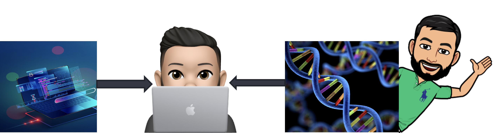

# DSCI 513: Databases and Data Retrieval
## Teaching squad

### Lecture Instructor



- I am Gittu George, Ph.D
- I am a Full-time Lecturer.
- Email Me: ggeorg02@cs.ubc.ca
- Office Hours: TBD. Check MDS calendar for updates.
- Research interests are at the intersection of computer science and genomics.
- I primarily teach cloud computing and database courses with MDS, Comp Science and MBAN.

### Lab Instructors
- Andy Section 2 Instructor
- Prajeet Section 1 Instructor

## Lectures

| #    | Topic                                                                    |
| :--- | :----------------------------------------------------------------------- |
| 1    | Introduction to databases, the relational model, SQL, basic queries      |
| 2    | Data types, filtering, derived columns and aliases, functions            |
| 3    | Aggregations, grouping, joins                                            |
| 4    | Creating, modifying, and dropping tables and rows, integrity constraints |
| 5    | Transactions, ACID, subqueries, set operations                           |
| 6    | Views, CTEs, window functions, indexing, query optimization              |
| 7    | Semi-structured data, non-relational databases, basic queries in MongoDB |
| 8    | Intro to big data, advanced queries in MongoDB, aggregation pipelines    |

## Lab assignments

There will be one lab assignment per week. We will follow the standard MDS lab deadlines.

## Quizzes

Quizzes will be **closed book (cheat sheet allowed)**. For the dates/times of the quizzes, see the [MDS calendar](https://ubc-mds.github.io/calendar/).

```{admonition} Quiz Instructions/policies

- You must click Save on every question before the timer runs out or your work will not be saved.

- All quiz questions in 513 are autograded. If your code has a syntax error, you'll receive a zero. Only copy the code needed to produce the required output.

- pgadmin workspace will be provided, to test your queries for coding questions.

- For coding questions, partial credit is not awarded. However, you will receive 25% of the points if your code runs and is VERY close to the expected output, meaning it covers almost all requirements but misses just one item; otherwise, no points will be awarded.
```

```{admonition} Quiz content
- Quiz questions will be based on content from the lecture notes, theme notes (class demos), and lab exercises. Please ensure you review all required lecture notes thoroughly. While some topics may not be discussed in detail during class, you are still responsible for understanding them if they are included in the lecture notes. 

- If any topics in the lecture notes need clarification, please check with the teaching team during labs and office hours. Optional content will not be tested, and you will not encounter questions beyond what has been covered in class, lecture notes, or lab concepts.
```  

## Installation

- The first step to setup the course's conda environment is to run `conda install -c conda-forge nb_conda_kernels` in your **base** environment, but if you have done so already for another MDS course, skip this step.

- The conda environment file for the course is [here](dsci513env.yml). To create the environment, run `conda env create -f dsci513env.yml` (you only need to do this once). Finally, launch Jupyter Lab from your **base** environment, and select the `dsci513` kernel from within Jupyter.

## Course learning objectives

- Explain and justify the need for storing data in a database
- Describe tables, tuples, and attributes in the relational model
- Construct basic and advanced SQL statements to query relational databases
- Define and manipulate tables and tuples using data definition language
- Understand the usage of integrity constraints in relational databases
- Describe the concept of transactions and concurrency control
- Construct basic and advanced queries in a NoSQL DBMS

## Assessments 

- Quiz 1: 25%
- Quiz 2: 25%
- Labs: 46 % (11.5 each)
- iClicker: 4 % (0.5 for each lecture) - only for participation for all questions. Correctness not required. 

## Activities and helper sessions for this course:

- ***PrairieLearn Questions:*** For every lecture (subject to change, based on the time I get to create these questions)

This is also an experimental piece for this block. A variety of questions of different natures and styles to help you review and understand the materials covered in class. The SQL questions will be the same as what's in the lecture notes.

- ***Clicker/Discussion Questions:*** For every lecture (as needed)

    Just to take you through the lecture. Join [iclicker using this link](https://join.iclicker.com/GOOY)

- ***New SQL programmer session:*** Before Quiz 1

    This allows students who are very new to SQL to catch up with the speed at which we are covering the course. So that you won't be left behind when we move on to the second half of the block, the idea would be to take some crucial elements from lectures 1 - 4 and deliver a short lesson for around 30 minutes, and after that, we will open up the space for students to ask questions.

    > This session is strictly for students new to SQL. Others, please don't attend.

    > A TA will post more information as time gets closer.


## Timelines

| Event                                 | Description                                                                                                                                                                                                                                                                          | Announcement in slack | When/day/time                                                                                                                 |
|---------------------------------------|--------------------------------------------------------------------------------------------------------------------------------------------------------------------------------------------------------------------------------------------------------------------------------------|-----------------------|----------------------------------------------------------------------------------------------------------------------|
| Lecture notes                         | Lecture notes for all 8 lectures.                                                     | NO                    | All posted                                         |
| Pre Theme notes                    | Themes notes without clicker and discussion questions.                                                                                                                                                                                                                                  | NO                    | On the lecture day before the lecture.                                                               |
| Post Theme notes                    | Themes notes with clicker and discussion questions.                                                                                                                                                                                                                                  | NO                    | On the lecture day after the lecture and before 10 PM.                                                               |
| Quiz grade release                    | Follow general Quiz viewing procedures                                                                                                                                                                                                                | NO                   | Within 1 week                                                                              |
| Regrade requests                      | Follow [regrading instructions](https://ubc-mds.github.io/policies/#re-grading) carefully. TAs will keep track of students requesting regrades and will submit a report to me. Please make sure you read the regrade policy before submitting regrades.                              | NO                    | As per regrade policy and deadlines                                                                                  |
| Prarielearn practice questions        | For each lecture, there are multiple MCQs and/or various concept-check questions. These are valuable for quizzes. Additionally, you can practice SQL questions, which are identical to the lecture notes (well as I don't have time to come up with more).                                                                                                                                                                                                                            | NO                    | Before relevant lecture                                                                                            |
| Practice Quiz 1 and 2                 | Practice quizzes are released to help simulate quiz conditions. However, please note that they do not reflect the difficulty level of the questions you may encounter in the real quiz, nor do they simulate the actual time constraints.                                               | NO                    | Wednesday before the quiz week.                                                                                        |


## Regarding labs.

Lab related queries, clarifications, regrades and any other lab-related issues should be directed to the relevant lab instructors. 
- Andy Section 2 Instructor
- Prajeet Section 1 Instructor

## Slack Etiquette

- Use the `#001_513_database-data-ret` or `#002_513_database-data-ret` channel for all course-related questions. ***Please don't DM me for general course-related queries.*** If there are personal issues affecting your mental health, please feel free to DM me.
- Before asking a question in the channel, make sure you have done the following, 
   - You tried to solve the problem yourself for at least 15 - 20 min. There are many resources online which you can make use of.
   - Search the channel to see if it has been asked and answered. If your question is closely related to an existing question, ask it in the same thread.
- When asking a question, provide as much detail as possible. This includes a description of the:
   - Problem
   - Steps you have already taken to solve the problem
   - Results you expected
   - Results you got
   - ***More importantly, what you have tried to solve the problem***
- You might not be getting responses to your questions during the weekends, holidays, and off hours. So make sure you start working on it early. Make use of lab hours and office hours. 
>Note: Not clarifying lab-related questions early enough and getting stuck over the weekend does not count as a valid reason for incomplete work. Any confusion you might have should be clarified with the instructors during the week.
- Students are encouraged to answer their classmate's questions. You get a 💥 badge for answering questions. 😁

## Suggested material

Recommended:

- [Fehily, Chris. SQL: Visual QuickStart Guide, 3rd ed., Peachpit Press, 2008.](https://go.exlibris.link/tWGGwhRf)
- [DeBarros, Anthony. Practical SQL: A Beginner's Guide to Storytelling with Data, 1st ed., No Starch Press, 2018.](https://www.practicalsql.com/)
- [Matthew, Neil and Stones, Richard. Beginning Databases with PostgreSQL: From Novice to Professional, 2nd ed., Apress, 2005.](https://link.springer.com/book/10.1007/978-1-4302-0018-5)
- [Khan Academy's Intro to SQL course](https://www.khanacademy.org/computing/computer-programming/sql)
- [Software Carpentry's SQL tutorials](https://librarycarpentry.org/lc-sql/)
- [PostgreSQL Exercises](https://pgexercises.com/)

More advanced:

- [Ramakrishnan, Raghu and Gehrke, Johannes. Database Management Systems, 3rd ed., McGraw-Hill, 2002.](http://pages.cs.wisc.edu/~dbbook/)
- [Karwin, Bill. SQL Antipatterns: Avoiding the Pitfalls of Database Programming, The Pragmatic Bookshelf, 2010.](https://go.exlibris.link/JWzLR6ZL)
- [Celko, Joe. Joe Celko's SQL for Smarties: Advanced SQL Programming, Morgan Kaufmann, 2010.](https://go.exlibris.link/PGql723M)


## License

© 2024 Gittu George

Software licensed under [the MIT License](https://spdx.org/licenses/MIT.html), non-software content licensed under [the Creative Commons Attribution-NonCommercial-ShareAlike 4.0 International (CC BY-NC-SA 4.0) License](https://creativecommons.org/licenses/by-nc-sa/4.0/). See the [license file](LICENSE.md) for more information.